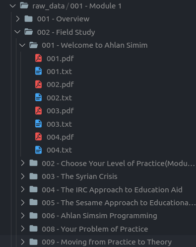

# HPL GPT Notes

Notes generated by GPT for How People Learn at Harvard

Here's a snap of the folder structure in which the course materials are downloaded

## What PDFs are downloaded?

- Each lesson is printed as a PDF
- Any downloadable PDF in a lesson

## TODO

- [ ] Script(s) to automate the downloading step
- [ ] Script(s) to automate the uploading step to something like Notion
- [ ] Use external links to websites and videos
- [ ] Links to paid materials for Harvard students
